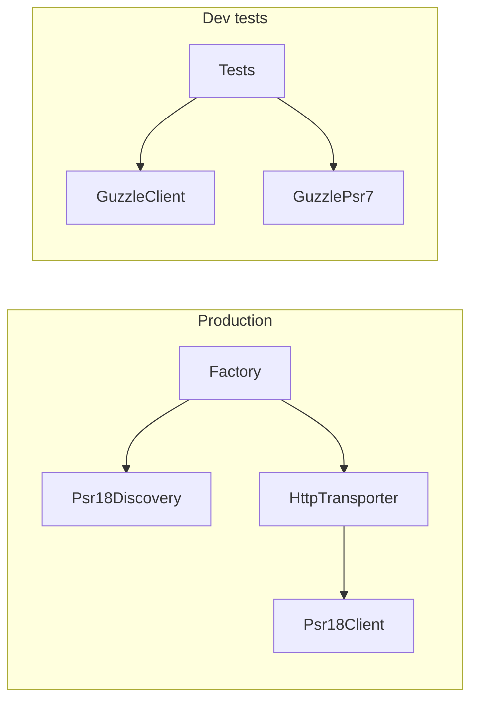

# Rename package and upgrade Guzzle to 8.2

## Current state

- Composer name is [`openai-php/client`](composer.json) while the git remote is already [`squipix/openai-php-client`](https://github.com/squipix/openai-php-client).
- Guzzle is **dev-only** (`guzzlehttp/guzzle: ^7.10.0`, `guzzlehttp/psr7: ^2.8.0`). Runtime HTTP uses PSR-18 discovery; Guzzle appears only in [`src/Factory.php`](src/Factory.php) (stream handler `instanceof GuzzleClient`) and [`src/Transporters/HttpTransporter.php`](src/Transporters/HttpTransporter.php) (`ClientException` + `getResponse()`).
- PHP namespace stays `OpenAI\` (Composer rename only; no autoload changes).



## 1. Composer package rename and Guzzle bump

Update [`composer.json`](composer.json):

| Field | From | To |
|-------|------|-----|
| `name` | `openai-php/client` | `squipix/openai-php-client` |
| `require-dev.guzzlehttp/guzzle` | `^7.10.0` | `^8.2` |
| `require-dev.guzzlehttp/psr7` | `^2.8.0` | `^3.1` (required by Guzzle 8) |

Optional (only if `composer update` reports conflicts): narrow `psr/http-message` from `^1.1.0\|^2.0.0` to `^2.0.0`, since Guzzle PSR-7 3.x requires PSR-7 message v2. The library’s own header handling in [`src/ValueObjects/Transporter/Headers.php`](src/ValueObjects/Transporter/Headers.php) already uses `array<string, string>`, which matches PSR-7 3 strict header rules.

Run `composer update` to generate [`composer.lock`](composer.lock) (none exists today) and refresh the CI cache key in [`.github/workflows/tests.yml`](.github/workflows/tests.yml).

## 2. Documentation and user-facing strings

Update references from `openai-php/client` to `squipix/openai-php-client`:

- [`README.md`](README.md): `composer require`, Packagist badge URLs, and GitHub badge/workflow URLs pointing at `squipix/openai-php-client` (keep or relocate `art/example.png` URL if the asset lives on the Squipix repo).
- [`src/Actions/Conversations/ItemObjects.php`](src/Actions/Conversations/ItemObjects.php), [`src/Actions/Responses/ItemObjects.php`](src/Actions/Responses/ItemObjects.php), [`src/Actions/Responses/OutputObjects.php`](src/Actions/Responses/OutputObjects.php): bug-report strings in `UnexpectedValueException` messages.

**Leave [`CHANGELOG.md`](CHANGELOG.md) historical links unchanged** (upstream PR URLs); add a short **Unreleased** entry at the top documenting the rename and Guzzle 8 dev upgrade.

Do **not** rewrite the entire CHANGELOG or change the `OpenAI\` namespace unless you ask for that separately.

## 3. Source code changes (expected minimal)

Guzzle 8.2 still provides `GuzzleHttp\Client`, `ClientException`, and `getResponse()` via `ResponseException` — existing patterns in Factory and HttpTransporter should remain valid.

**If tests fail after upgrade**, apply targeted fixes:

| Area | Likely issue | Fix |
|------|----------------|-----|
| [`src/Transporters/HttpTransporter.php`](src/Transporters/HttpTransporter.php) | Guzzle 8 exception taxonomy | Prefer `GuzzleHttp\Exception\ResponseException` (parent of `ClientException`) when reading error response bodies, still behind `ClientExceptionInterface` |
| Tests using `GuzzleHttp\Psr7\Response` | PSR-7 3 constructor / method casing | Ensure request methods are uppercase where assertions depend on `GET` vs `get` |
| [`tests/Arch.php`](tests/Arch.php) | Allowed Guzzle imports for `OpenAI\` namespace | Add `ResponseException` only if HttpTransporter import changes |

No change to streaming logic in Factory (`$client->send($request, ['stream' => true])`) unless Guzzle 8 deprecates `send` in favor of options on `request()` — verify against failing integration tests first.

## 4. Verification

Run the same checks as CI:

```bash
composer test
```

(or sequentially: `composer test:lint`, `test:types`, `test:type-coverage`, `test:unit`).

If anything fails only on `prefer-lowest`, adjust version constraints (e.g. minimum `guzzlehttp/psr7` patch) without widening beyond `^8.2` for Guzzle.

## Out of scope (per your choices)

- Adding `guzzlehttp/guzzle` to `require` (stays dev-only).
- Packagist registration / `composer.json` `replace` alias for `openai-php/client` (can be added later if you want drop-in migration for downstream apps).
