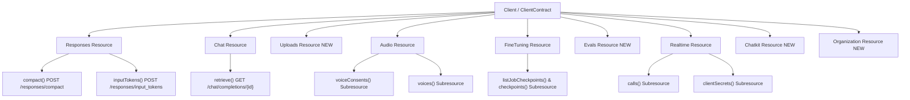

# Implementation Plan: Cover All OpenAI API Gaps

Comprehensive roadmap to bring `squipix/openai-php-client` into 100% feature parity with the live OpenAI API reference (September 2026), structured across prioritized phases with strict PHP 8.2+ typing, Pest tests, and PHPStan analysis.

---

## Goal Description

The `squipix/openai-php-client` package is a high-performance, strictly typed PHP SDK for the OpenAI API. While core surfaces (Chat, Responses, Embeddings, Files, Assistants, Vector Stores, Containers, Conversations, Skills, Webhooks) are well-implemented, several endpoints introduced in recent OpenAI API updates are missing:

1. **Method gaps on existing resources**: `Responses::compact()`, `Responses::inputTokens()`, `Chat::retrieve()`, and Webhook `unwrap()` helper.
2. **Missing high-impact endpoint groups**: Uploads API (`/uploads` multipart chunked uploads for files > 100MB), Audio Voice Consents & Custom Voices (`/audio/voice_consents`, `/audio/voices`), Fine-Tuning Job Checkpoints & Permissions.
3. **Missing advanced and beta endpoint groups**: Evals API (`/evals`), Realtime Calls (`/realtime/calls`) & Client Secrets (`/realtime/client_secrets`), Beta Chatkit (`/chatkit`).
4. **Administration & Organization endpoints**: Org management (`/organization/...`) using admin keys.
5. **Deprecated endpoints cleanup**: Assessment of `Edits` and `FineTunes` resources removed by OpenAI in Jan 2024.

---

## User Review Required

> [!IMPORTANT]
> **Scope & Prioritization Alignment**  
> We have grouped the missing endpoints into 5 executable phases ordered by practical impact. Please confirm if you want us to execute all phases sequentially, or focus on Phases 1–3 first (which cover all mainstream developer and model APIs before admin/beta surfaces).

> [!WARNING]
> **Deprecated Endpoints Strategy (`Edits`, `FineTunes`)**  
> OpenAI shut down `/edits` and `/fine-tunes` in January 2024. Currently, they remain in `src/Resources/` marked `@deprecated`. We recommend retaining them with explicit deprecation docblocks and runtime deprecation triggers to avoid breaking consumers, or optionally removing them if this is a major version bump.

---

## Open Questions

> [!NOTE]
> 1. **Administration API Scope**: Should Organization/Administration APIs (`/organization/audit_logs`, `/organization/admin_api_keys`, `/organization/projects`, etc.) be part of the main `Client` (e.g. `$client->organization()`), or should they be introduced in a separate `AdminClient` to differentiate admin key requirements?  
>    *(Recommended: Expose `$client->organization()` on `Client` matching the pattern of other resources, but document the admin key requirement).*
> 2. **Execution Order**: Should Phase 1 (high-value immediate gaps: `Responses::compact`, `Chat::retrieve`, `Responses::inputTokens`, Webhook `unwrap`) be implemented and verified first as a focused PR/commit?

---

## Proposed Changes



---

### Phase 1: High-Value Method Gaps on Existing Resources

#### 1. `Responses::compact()` (`POST /responses/compact`)
Compacts long-running conversation history using OpenAI compaction models, returning compacted context items and encryption details.

##### [NEW] `src/Responses/Responses/CompactResponse.php`
- Implements `ResponseContract`, `ResponseHasMetaInformationContract`
- Properties:
  - `string $id`
  - `string $object` (always `'response.compaction'`)
  - `int $createdAt`
  - `ResponseOutputObjectReturnType $output` (uses `OutputObjects::parse()` which already supports `OutputCompaction`)
  - `CreateResponseUsage $usage`
- Methods: `from(array $attributes, MetaInformation $meta): self`, `toArray(): array`

##### [MODIFY] `src/Contracts/Resources/ResponsesContract.php`
```diff
+   /**
+    * Compacts conversation history.
+    *
+    * @see https://developers.openai.com/api/reference/resources/responses/methods/compact
+    *
+    * @param  array<string, mixed>  $parameters
+    */
+   public function compact(array $parameters): CompactResponse;
```

##### [MODIFY] `src/Resources/Responses.php`
```diff
+   public function compact(array $parameters): CompactResponse
+   {
+       $payload = Payload::create('responses/compact', $parameters);
+
+       /** @var Response<CompactResponseType> $response */
+       $response = $this->transporter->requestObject($payload);
+
+       return CompactResponse::from($response->data(), $response->meta());
+   }
```

##### [MODIFY] `src/Testing/Resources/ResponsesTestResource.php`
- Record `compact` call in fake.

##### [NEW] `tests/Fixtures/ResponsesCompact.php` & Pest Tests in `tests/Resources/Responses.php`

---

#### 2. `Responses::inputTokens()` (`POST /responses/input_tokens`)
Calculates token counts for inputs before generating a response.

##### [NEW] `src/Responses/Responses/InputTokensResponse.php`
- Properties:
  - `string $object` (always `'response.input_tokens'`)
  - `int $inputTokens`
- Methods: `from(array $attributes, MetaInformation $meta): self`, `toArray(): array`

##### [MODIFY] `src/Contracts/Resources/ResponsesContract.php` & `src/Resources/Responses.php`
```diff
+   public function inputTokens(array $parameters): InputTokensResponse
+   {
+       $payload = Payload::create('responses/input_tokens', $parameters);
+
+       /** @var Response<array{object: string, input_tokens: int}> $response */
+       $response = $this->transporter->requestObject($payload);
+
+       return InputTokensResponse::from($response->data(), $response->meta());
+   }
```

---

#### 3. `Chat::retrieve()` (`GET /chat/completions/{id}`)
Retrieves a previously stored chat completion created with `store: true`.

##### [MODIFY] `src/Contracts/Resources/ChatContract.php`
```diff
+   /**
+    * Retrieves a stored chat completion with the given ID.
+    *
+    * @see https://developers.openai.com/api/reference/resources/chat/subresources/completions/methods/retrieve
+    */
+   public function retrieve(string $id): CreateResponse;
```

##### [MODIFY] `src/Resources/Chat.php`
```diff
+   public function retrieve(string $id): CreateResponse
+   {
+       $payload = Payload::retrieve('chat/completions', $id);
+
+       /** @var Response<CreateResponseType> $response */
+       $response = $this->transporter->requestObject($payload);
+
+       return CreateResponse::from($response->data(), $response->meta());
+   }
```

##### [MODIFY] `src/Testing/Resources/ChatTestResource.php`
- Add `retrieve` fake recording.

---

#### 4. Webhooks `unwrap()` Helper
Parses and verifies webhook payloads directly into associative arrays.

##### [MODIFY] `src/Webhooks/WebhookSignatureVerifier.php`
```diff
+   /**
+    * Verifies the request signature and returns the decoded JSON payload.
+    *
+    * @return array<string, mixed>
+    * @throws WebhookVerificationException
+    */
+   public function unwrap(RequestInterface $request): array
+   {
+       $this->verify($request);
+       $body = (string) $request->getBody();
+       $decoded = json_decode($body, true);
+       if (! is_array($decoded)) {
+           throw new \UnexpectedValueException('Invalid JSON payload');
+       }
+       return $decoded;
+   }
```

---

### Phase 2: Uploads API & Audio/Fine-Tuning Enhancements

#### 1. Uploads API (`/uploads`)
Allows uploading large files (>100MB up to 8GB) in chunks before attaching to Files/Assistants.

##### Files to create:
- [NEW] `src/Contracts/Resources/UploadsContract.php`
  - `create(array $parameters): CreateResponse` (`POST /uploads`)
  - `uploadPart(string $uploadId, array $parameters): UploadPartResponse` (`POST /uploads/{upload_id}/parts`, multipart)
  - `complete(string $uploadId, array $parameters): UploadResponse` (`POST /uploads/{upload_id}/complete`)
  - `cancel(string $uploadId): UploadResponse` (`POST /uploads/{upload_id}/cancel`)
- [NEW] `src/Resources/Uploads.php`
- [NEW] `src/Responses/Uploads/CreateResponse.php`
- [NEW] `src/Responses/Uploads/UploadPartResponse.php`
- [NEW] `src/Responses/Uploads/UploadResponse.php`
- [NEW] `src/Testing/Resources/UploadsTestResource.php`
- [MODIFY] `src/Contracts/ClientContract.php`, `src/Client.php`, `src/Testing/ClientFake.php` (expose `$client->uploads()`)
- [NEW] `tests/Fixtures/Uploads.php`, `tests/Resources/Uploads.php`, `tests/Testing/Resources/UploadsTestResource.php`

---

#### 2. Audio Voice Consents & Voices
Custom voice creation and consent management.

##### Files to create:
- [NEW] `src/Contracts/Resources/AudioVoiceConsentsContract.php`
  - `create(array $parameters): CreateResponse` (`POST /audio/voice_consents`, multipart: name, language, recording)
  - `list(array $parameters = []): ListResponse` (`GET /audio/voice_consents`)
  - `retrieve(string $id): RetrieveResponse` (`GET /audio/voice_consents/{id}`)
  - `update(string $id, array $parameters): UpdateResponse` (`POST /audio/voice_consents/{id}`)
  - `delete(string $id): DeleteResponse` (`DELETE /audio/voice_consents/{id}`)
- [NEW] `src/Resources/AudioVoiceConsents.php`
- [NEW] `src/Contracts/Resources/AudioVoicesContract.php`
  - `create(array $parameters): CreateResponse` (`POST /audio/voices`, multipart: name, consent, audio_sample)
- [NEW] `src/Resources/AudioVoices.php`
- [NEW] Response DTOs in `src/Responses/Audio/VoiceConsents/` and `src/Responses/Audio/Voices/`
- [MODIFY] `src/Resources/Audio.php`, `src/Contracts/Resources/AudioContract.php`, `src/Testing/Resources/AudioTestResource.php`:
  - `voiceConsents(): AudioVoiceConsentsContract`
  - `voices(): AudioVoicesContract`
- [NEW] Tests and fixtures in `tests/Resources/AudioVoiceConsents.php` and `tests/Resources/AudioVoices.php`

---

#### 3. Fine-Tuning Job Checkpoints & Permissions
- [MODIFY] `src/Contracts/Resources/FineTuningContract.php` & `src/Resources/FineTuning.php`:
  - `listJobCheckpoints(string $jobId, array $parameters = []): ListJobCheckpointsResponse` (`GET /fine_tuning/jobs/{job_id}/checkpoints`)
  - `checkpoints(): FineTuningCheckpointsContract`
- [NEW] `src/Contracts/Resources/FineTuningCheckpointsContract.php` & `src/Resources/FineTuningCheckpoints.php`:
  - `createPermission(string $checkpointId, array $parameters): CreatePermissionResponse` (`POST /fine_tuning/checkpoints/{checkpoint}/permissions`)
  - `deletePermission(string $checkpointId, string $permissionId): DeletePermissionResponse` (`DELETE /fine_tuning/checkpoints/{checkpoint}/permissions/{permission}`)
- [NEW] DTOs in `src/Responses/FineTuning/Checkpoints/`
- Tests and fixtures for checkpoints and permissions.

---

### Phase 3: Evals & Realtime Calls / Secrets

#### 1. Evals API (`/evals`)
Evaluation schemas, runs, and grading.

##### Files to create:
- [NEW] `src/Contracts/Resources/EvalsContract.php`
  - `create(array $parameters): CreateResponse` (`POST /evals`)
  - `retrieve(string $id): RetrieveResponse` (`GET /evals/{id}`)
  - `update(string $id, array $parameters): UpdateResponse` (`POST /evals/{id}`)
  - `delete(string $id): DeleteResponse` (`DELETE /evals/{id}`)
  - `list(array $parameters = []): ListResponse` (`GET /evals`)
  - `cancelRun(string $evalId, string $runId): CancelRunResponse` (`POST /evals/{eval_id}/runs/{run_id}/cancel`)
- [NEW] `src/Resources/Evals.php`
- [NEW] Response DTOs in `src/Responses/Evals/`
- [NEW] `src/Testing/Resources/EvalsTestResource.php`
- [MODIFY] `src/Contracts/ClientContract.php`, `src/Client.php`, `src/Testing/ClientFake.php` (expose `$client->evals()`)
- [NEW] Tests in `tests/Resources/Evals.php` and fixtures

---

#### 2. Realtime Calls & Client Secrets
SIP call handling and ephemeral client secrets for Realtime sessions.

##### Files to create:
- [NEW] `src/Contracts/Resources/RealtimeCallsContract.php`
  - `create(array $parameters): CreateResponse` (`POST /realtime/calls`)
  - `accept(string $callId, array $parameters): AcceptResponse` (`POST /realtime/calls/{id}/accept`)
  - `hangup(string $callId): HangupResponse` (`POST /realtime/calls/{id}/hangup`)
  - `refer(string $callId, array $parameters): ReferResponse` (`POST /realtime/calls/{id}/refer`)
  - `reject(string $callId): RejectResponse` (`POST /realtime/calls/{id}/reject`)
- [NEW] `src/Resources/RealtimeCalls.php`
- [NEW] `src/Contracts/Resources/RealtimeClientSecretsContract.php`
  - `create(array $parameters = []): CreateResponse` (`POST /realtime/client_secrets`)
- [NEW] `src/Resources/RealtimeClientSecrets.php`
- [MODIFY] `src/Resources/Realtime.php`, `src/Contracts/Resources/RealtimeContract.php`:
  - `calls(): RealtimeCallsContract`
  - `clientSecrets(): RealtimeClientSecretsContract`
- [NEW] Response DTOs in `src/Responses/Realtime/Calls/` and `src/Responses/Realtime/ClientSecrets/`
- Tests and fixtures for calls and client secrets.

---

### Phase 4: Beta Chatkit API

#### Chatkit Sessions & Threads
- [NEW] `src/Contracts/Resources/ChatkitContract.php` (or `Beta/Chatkit`)
  - `sessions(): ChatkitSessionsContract` (`POST /chatkit/sessions`, `POST /chatkit/sessions/{id}/cancel`)
  - `threads(): ChatkitThreadsContract` (`GET /chatkit/threads`, `GET /chatkit/threads/{id}`, `DELETE /chatkit/threads/{id}`, `GET /chatkit/threads/{id}/items`)
- [NEW] Resources, response DTOs, contracts, fakes, and Pest tests.

---

### Phase 5: Organization / Administration APIs

#### Organization Resources (`/organization/...`)
- [NEW] `src/Contracts/Resources/OrganizationContract.php` & `src/Resources/Organization.php`
  - Audit logs (`/organization/audit_logs`, `/organization/audit_logs/admin_api_keys`, `/organization/audit_logs/usage`)
  - Invites (`/organization/invites`)
  - Users & Roles (`/organization/users`, `/organization/roles`)
  - Projects (`/organization/projects`, rate limits, service accounts, project users/groups)
- [MODIFY] `src/Contracts/ClientContract.php`, `src/Client.php`, `src/Testing/ClientFake.php` (expose `$client->organization()`)
- Tests, DTOs, fixtures.

---

## Verification Plan

Every phase will be validated through strict automated test suites conforming to repository standards:

### Automated Tests
1. **Unit Tests**:
   ```bash
   vendor/bin/pest --colors=always
   ```
   *Expected: All existing 1221 tests + new tests pass.*

2. **PHPStan Static Analysis**:
   ```bash
   vendor/bin/phpstan analyse --ansi
   ```
   *Expected: 0 errors at level 8+ with full generic type definitions.*

3. **Type Coverage**:
   ```bash
   vendor/bin/pest --type-coverage --min=100
   ```
   *Expected: 100% strict type coverage across all new classes, properties, and methods.*

4. **Code Style (Pint)**:
   ```bash
   vendor/bin/pint --test -v --parallel
   ```
   *Expected: Clean pass with no syntax/style discrepancies.*

5. **Combined Verification Suite**:
   ```bash
   composer test
   ```

### Manual Verification
- Verify response objects serialize correctly to/from arrays and JSON.
- Verify `ClientFake` correctly intercepts and asserts calls for all new resources.
